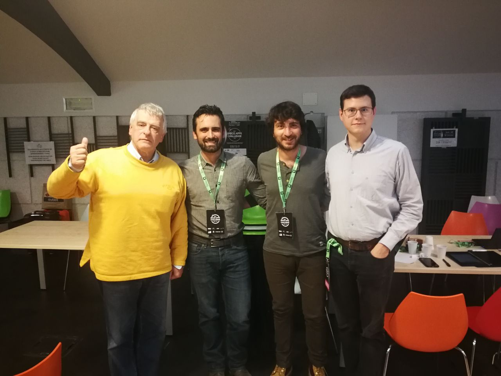

# spaceappschallenge-2019

Our work in participation to the [NASA International Space Apps Challenge 2019 in Torino](https://www.i3p.it/article/nasa-space-apps-challenge-torino).

## The Pitch

[Link to the slide deck](https://slides.com/gianpaolomacario/moebius-sail/fullscreen?token=NgdlLPBl)

## The Moebius Sail Team

| Firstname  | Lastname    | Blog | GitHub_ID                                  | Telegram_ID   |
|------------|-------------|------|--------------------------------------------|---------------|
| Gianpaolo  | Macario     | [gmacario.github.io](https://gmacario.github.io/) | [@gmacario](https://github.com/gmacario) | @gmacario |
| Gianfranco | Poncini     | [www.belinonda.it](http://www.belinonda.it/) | [@Muwattalli](https://github.com/Muwattalli) | @Togodumno |
| Carlo      | Di Costanzo | -    | [@xxx](https://github.com/xxx)             | +39-327-1694837 |
| Demetrio   | Scuncia     | -    | [@xxx](https://github.com/xxx)             | +39-349-6000209 |
| Nicolo'    | Lombardo    | -    | [@naquola](https://github.com/naquola)     | @naquola        |
| Riccardo   | Salgarella  | -    | [@salgherik](https://github.com/salgherik) | @salgherik      |
| -          | -           | -    | -                                          | -               |
| Valerio    | Sacchetto   | -    | [@zakkos](https://github.com/zakkos)       | +39-347-6548260 |
| Gloria     | Puppi       | -    | [@gloryp](https://github.com/gloryp)       | @Gloria_Py      |

## Other links

* [Moebius Sail - Landing Page](http://moebius-sail.co/)
* [NASA International Space Apps Challenge 2019](https://www.spaceappschallenge.org/)
* [The Moebius Sail Team ad SpaceAppChallenge.org](https://2019.spaceappschallenge.org/challenges/our-moon/eeny-meeny-miney-sample/teams/moebius-sail/project)
* [Join the Telegram Group](https://t.me/joinchat/CTVnjReaQF0oVPnUsCVS7g)
* [Edit Deck: moebius-sail](https://slides.com/gianpaolomacario/moebius-sail/edit)

## Copyright and License

spaceappschallenge-2019 is licensed under the MIT License - for details please see the `LICENSE` file.

Copyright (C) 2019, [Gianpaolo Macario](http://gmacario.github.io/) and the other Team Members.

<!-- EOF -->
